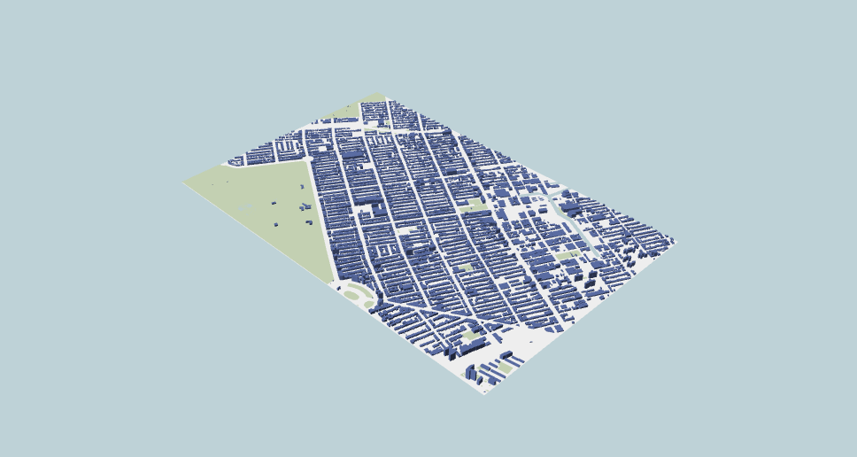

# CS425 - Computer Graphics I (Spring 2022)

## Assignment 1: Triangle meshes rendering
The goal of this assignment is to get you familiar with transformations, and triangle mesh rendering. You will develop an application to render an urban setting described in an external JSON file that must be uploaded by the user through a configuration panel. The JSON file has four layers describing the elements and color of buildings, parks, water and surface of a particular region (see below for a complete description of the file). You should use a unique buffer and VAO for *each* layer.

There are five tasks, and you are free to use the skeleton code provided. The code has some comments detailing what needs to be implemented in each function; it contains functions to handle file upload, and user interactions through the control panel, as well as four main classes:
- `FlatProgram`: handles shading of flat layers (water, parks, surface). These layers do not contain normals (as you can notice in the file description below), so they have to be shaded by a constant color. The color of each layer is also specified in the JSON file.
- `BuildingProgram`: handles shading of building layer. This layer contains normals and a constant color, so use this information to shade the side of the buildings accordingly. You do not have to implement any illumination model, it is enough to simply color the side of the buildings based on the layer color and the angle between a direction of your choosing and the face of the building.
- `Layer` and `BuildingLayer`: handles flat layers, and building layer.
- `Layers`: collection of layers.

File `utils.js` contains some useful functions to create [shaders](https://developer.mozilla.org/en-US/docs/Web/API/WebGLShader), [programs](https://developer.mozilla.org/en-US/docs/Web/API/WebGLProgram), [buffers](https://developer.mozilla.org/en-US/docs/Web/API/WebGLBuffer), [VAOs](https://developer.mozilla.org/en-US/docs/Web/API/WebGLVertexArrayObject), as well as [matrix operations](https://developer.mozilla.org/en-US/docs/Web/API/WebGL_API/Matrix_math_for_the_web), [projections](http://www.songho.ca/opengl/gl_projectionmatrix.html), and [lookat](https://www.khronos.org/registry/OpenGL-Refpages/gl2.1/xhtml/gluLookAt.xml).

Here is an example of assignment 1 (however, pay attention that the rotation and zoom functionalities should be implemented through mouse movements):


### Tasks

#### Task 1
Create a configuration panel with four components: 
1) A [dropdown](https://developer.mozilla.org/en-US/docs/Web/HTML/Element/option) menu with values *perspective* and *orthographic*. Changing the selected option should change the projection type (see Task 5).
2) A file [input](https://developer.mozilla.org/en-US/docs/Web/HTML/Element/input/file) element responsible for loading a JSON file (see Task 3).

#### Task 2
Create functionalities to handle mouse input. In other words, as the user clicks and moves the mouse around the canvas, you should handle the appropriate events (see [here](https://developer.mozilla.org/en-US/docs/Web/API/MouseEvent)) and update two variables: one storing the horizontal mouse movement and another one storing the vertical mouse movement. Ensure that both variables are constrained to the ranges: 0-360, and 1-100. Even before drawing anything, ensure you have implemented this functionality correctly.

#### Task 2
Connect the file input element to the `window.handleFile` function so that every time a JSON file is uploaded by the user, `window.handleFile` is called. You should also complete the `window.handleFile` function so that it properly parses the JSON file, and adds the appropriate layer to the layers dictionary. In order to handle layers, you should implement the `init` and `draw` functions in `Layer` and `BuildingLayer`.

#### Task 3
You should implement a view transformation matrix inside `updateViewMatrix` in such a way that when the user drags the mouse (see Task 2), the camera rotates around the centerpoint of the layers. The initial position of the camera should be similar to the image below:



#### Task 4
You should implement two types of projections (orthographic and perspective). This should be handled by function `updateProjectionMatrix`. Notice that even in an orthographic projection you should be able to zoom-in and zoom-out towards the centerpoint of the model (computed inside `getCentroid`).

<p align="center">
 
</p>

#### JSON format

The JSON file contains coordinates, indices, and colors for 4 layers (buildings, water, parks, surface). The building layer also contains normals for each vertex. You can download a zip file with a sample json [here](https://fmiranda.me/courses/cs425-spring-2021/city.json.zip).

The `coordinates` array consists of a list of all the vertices for that particular layer. The `indices` array contains the indices of the vertices used to render triangles via `glDrawElements`. That is, starting from the first element in the indices array, every three values correspond to indices of vertices that make a triangle in the triangle mesh.

```javascript
{
    'buildings': 
    {
        'coordinates': [x_1,y_1,z_1,x_2,y_2,z_2,...,x_n,y_n,z_n],
        'indices': [i_1,i_2,...,i_n],
        'normals': [x_1,y_1,z_1,x_2,y_2,z_2,...,x_n,y_n,z_n],
        'color': [r,g,b,a]
    },
    'water': 
    {
        'coordinates': [x_1,y_1,z_1,x_2,y_2,z_2,...,x_n,y_n,z_n],
        'indices': [i_1,i_2,...,i_n],
        'color': [r,g,b,a]
    },
    'parks': 
    {
        'coordinates': [x_1,y_1,z_1,x_2,y_2,z_2,...,x_n,y_n,z_n],
        'indices': [i_1,i_2,...,i_n],
        'color': [r,g,b,a]
    },
    'surface':
    {
        'coordinates': [x_1,y_1,z_1,x_2,y_2,z_2,...,x_n,y_n,z_n],
        'indices': [i_1,i_2,...,i_n],
        'color': [r,g,b,a]
    },
}
```

### Submission
The delivery of the assignments will be done using GitHub Classes. It will not be necessary to use any external JavaScript library for your assignments. If you do find the need to use additional libraries, please send us an email or Discord message to get approval. Your assignment should contain at least the following files:
- index.html: the main HTML file.
- gl.js: assignment main source code.
- \*.vert.js: vertex shaders.
- \*.frag.js: fragment shaders.

### Grading
The code will be evaluated on Firefox. Your submission will be graded according to the quality of the image results, interactions, and correctness of the implemented algorithms. Your README.me file will also be graded. 

To get a C on the assignment, your application should be able to load a JSON file in the format specified above, and visualize at least one layer using a perspective projection. To get a B on the assignment, your application should visualize at least two layers using both a perspective projection as well as an orthographic projection. On top of that, the application should implement the zoom interaction specified in the configuration panel. To get an A on the assignment, the application must shade the buildings according to their normals, visualize all four layers, consider the rotation interaction, and have a detailed readme file.
